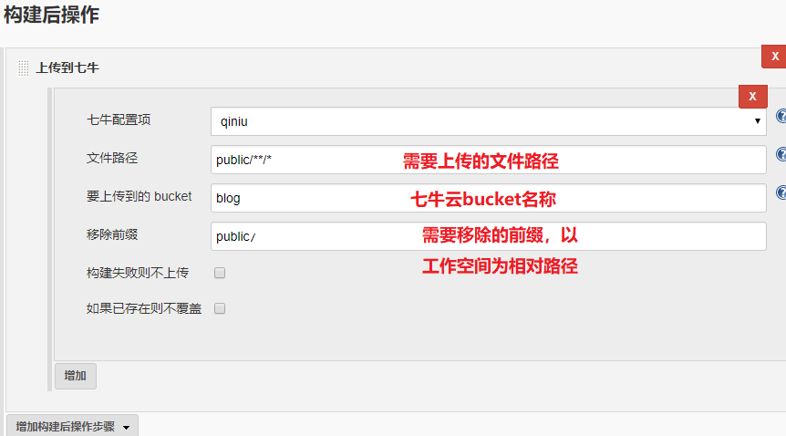

七牛云上传插件
===========

### 支持功能

* 文件路径前缀添加　　
* 生成文件下载链接


### 设置

1.系统管理－系统设置,添加七牛`AccessKey`和`SecertKey`。


2.在任务中添加`构建后操作`




### 已经编译文件下载

[qinniu-file.hpi](https://github.com/YahuiWong/publish-over-qiniu-plugin/blob/master/qinniu-file.hpi?raw=true)

### 手动编译
```
mvn package -DskipTests
```


>  项目参考 
> 1. [七牛云上传插件](https://github.com/ipy/qiniu-plugin)，并增加新功能。
> 2. [七牛云上传插件](https://github.com/onloadcc/qiniu-file),将文件发布修改为文件夹发布


